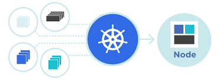

<!--

  
-->
<h3 align="left">Kubernetes Cluster Mesh 2022</h3>
  

     This repository is backgroud to leverage feature of cilium and cluster mesh capability to handle application ha in extreme level and across cluster
   

### Slide for Presentation

 * [Slide Presentation](https://speakerdeck.com/praparn/extreme-k8s-ha-across-cluster-with-cluster-mesh)

### Demo Vide0

 * [Video Part1](https://youtu.be/LSSNA-W2GWA)
 * [Video Part2](https://youtu.be/f84rzH8ERCs)

### Remark

* As project are share experience for operate multiple k8s cluster with cilium network plugin. Please take you owner risk for replicate and check official document before operate

### Built With

* [CNCF Cilium GA](https://www.cncf.io/blog/2022/07/20/cilium-1-12-ga-cilium-service-mesh-and-other-major-new-features-for-enterprise-kubernetes/)
* [Release 1.12](https://isovalent.com/blog/post/cilium-release-112/)
* [Cilium Get Start](https://docs.cilium.io/en/stable/gettingstarted/)
* [Kubernetes](https://kubernetes.io/)

(<a href="#top">back to top</a>)

<!-- GETTING STARTED -->

 Pre-requiste before start lab                                                                                                             
 1. Install prerequiste software for operate:

	1.1 Check for module enable (IF not run script below for enable)
        sudo lsmod | grep -e ip_vs -e nf_conntrack_ipv4
	
    1.2 Check and reinstall cilium binary
    #Cilium Cli
    curl -L --remote-name-all https://github.com/cilium/cilium-cli/releases/latest/download/cilium-linux-amd64.tar.gz{,.sha256sum}
    sha256sum --check cilium-linux-amd64.tar.gz.sha256sum
    sudo tar xzvfC cilium-linux-amd64.tar.gz /usr/local/bin
    rm cilium-linux-amd64.tar.gz{,.sha256sum}

    #Hubble Cli
    export HUBBLE_VERSION=$(curl -s https://raw.githubusercontent.com/cilium/hubble/master/stable.txt)
    curl -L --remote-name-all https://github.com/cilium/hubble/releases/download/$HUBBLE_VERSION/hubble-linux-amd64.tar.gz{,.sha256sum}
    sha256sum --check hubble-linux-amd64.tar.gz.sha256sum
    sudo tar xzvfC hubble-linux-amd64.tar.gz /usr/local/bin
    rm hubble-linux-amd64.tar.gz{,.sha256sum}

    1.3: Install helm client on master node by command:
	curl -fsSL -o get_helm.sh https://raw.githubusercontent.com/helm/helm/master/scripts/get-helm-3
   chmod 700 get_helm.sh
   ./get_helm.sh                                                                                                           

<!-- LICENSE -->
## License

Distributed under the Apacher License. See `LICENSE.txt` for more information.

(<a href="#top">back to top</a>)

<!-- CONTACT -->
## Contact

Praparn Lueangphoonlap - [@facebook](https://www.facebook.com/praparn.lungpoonlap) - eva10409@gmail.com

Project Link: [https://https://github.com/praparn/kubernetes-clustermesh-092022](https://https://github.com/praparn/kubernetes-clustermesh-092022)

(<a href="#top">back to top</a>)

(<a href="#top">back to top</a>)

<!-- MARKDOWN LINKS & IMAGES -->
<!-- https://www.markdownguide.org/basic-syntax/#reference-style-links -->
[contributors-shield]: https://img.shields.io/github/contributors/github_username/repo_name.svg?style=for-the-badge
[contributors-url]: https://github.com/github_username/repo_name/graphs/contributors
[forks-shield]: https://img.shields.io/github/forks/github_username/repo_name.svg?style=for-the-badge
[forks-url]: https://github.com/github_username/repo_name/network/members
[stars-shield]: https://img.shields.io/github/stars/github_username/repo_name.svg?style=for-the-badge
[stars-url]: https://github.com/github_username/repo_name/stargazers
[issues-shield]: https://img.shields.io/github/issues/github_username/repo_name.svg?style=for-the-badge
[issues-url]: https://github.com/github_username/repo_name/issues
[license-shield]: https://img.shields.io/github/license/github_username/repo_name.svg?style=for-the-badge
[license-url]: https://github.com/github_username/repo_name/blob/master/LICENSE.txt
[linkedin-shield]: https://img.shields.io/badge/-LinkedIn-black.svg?style=for-the-badge&logo=linkedin&colorB=555
[linkedin-url]: https://linkedin.com/in/linkedin_username
[product-screenshot]: images/screenshot.png